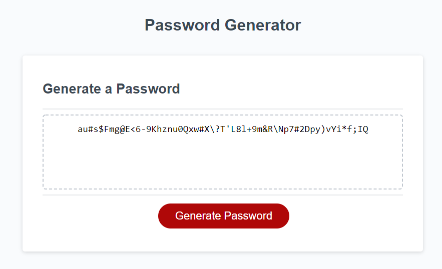

Homework Assignment - 03 JavaScript: Password Generator

## Description
The focus of this homework assignment for the University of Toronto SCS Coding Boot Camp was to create a password generator using JavaScript. I was provided with an HTML file, CSS style sheet and some JavaScript starter code. I wrote JavaScript code that created an application enabling users to generate random passwords based on criteria that they selected within established password rules.

## Key Features
- When the user enters a desired password length, the application verifies that the value is a number and is between 8 and 128, if either of these conditions is not true the user is informed to try again and allowed to do so.
- Allows the user to select if they wish to generate a password from lowercase letters, uppercase letters, digits (0 - 9), and/or special characters.
- Application checks that the user selects at least one character set otherwise they are notified to ensure they select at least one and are provided the options again to select from.
- An array of possible characters for this user's password is created by concatenating the selected arrays of acceptable characters (e.g., digits, special characters)
- Password is created by selecting values in this array of possible characters based on array index using a random number created using Math.floor() & Math.random() functions.
- Password will be of desired length through use of a for loop and then written into textbox on the page.

## Link
Website can be found here: https://darylnauman.github.io/password-generator/

## Screenshot
The following image shows a snapshot of a portion of the webpage:

